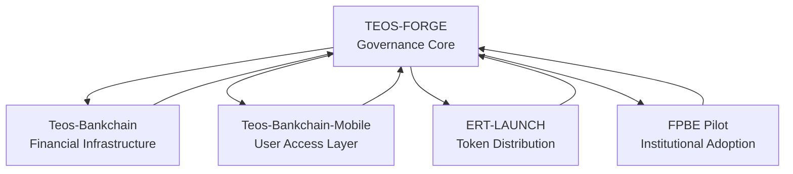

# Integrations — TEOS Sovereign Stack

This document explains how **TEOS Forge** governs external repositories in the Elmahrosa ecosystem. It ensures that all modules (Bankchain, ERT‑LAUNCH, FPBE pilots) remain **sovereign originals** under Elmahrosa International.

---

## 🔹 TEOS Forge (Governance Core)

* **Role:** Civic‑grade governance engine for Digital Public Infrastructure (DPI).
* **Scope:** Issues, PRs, CI, audit trails, treasury reports, contributor payouts.
* **Standing:** Egypt‑originated, globally sovereign, source‑available under dual license (PolyForm + TESL).
* **Integration:** Governs external repos by enforcing audit, contribution, and treasury discipline.

---

## 🔹 Bankchain (Core Financial Infrastructure)

* **Repo:** [Teos-Bankchain](https://github.com/Elmahrosa/Teos-Bankchain)
* **Role:** Backend financial coordination layer (treasury, compliance, transaction logic).
* **Governance:** All commits and PRs are subject to TEOS Forge audit rules.
* **Integration:** Treasury reports flow back into TEOS Forge for contributor payouts.

---

## 🔹 Bankchain Mobile (User Access Layer)

* **Repo:** [Teos-Bankchain-Mobile](https://github.com/Elmahrosa/Teos-Bankchain-Mobile)
* **Role:** Mobile client for wallets, user onboarding, and civic participation.
* **Governance:** Mobile contributions are logged in TEOS Forge contributor dashboards.
* **Integration:** Wallet and badge logic sync with TEOS Forge governance modules.

---

## 🔹 ERT-LAUNCH (Token Distribution)

* **Repo:** [ERT-LAUNCH](https://github.com/Elmahrosa/ERT-LAUNCH)
* **Role:** Presale, vesting, and tokenomics for Elmahrosa Reserve Token (ERT).
* **Governance:** Launch parameters and treasury allocations are reviewed under TEOS Forge audit.
* **Integration:** Contributor earnings in ERT are logged in TEOS Forge treasury reports.

---

## 🔹 FPBE Pilot (Institutional Adoption)

* **Repo:** [FPBE-First-Pimisr-Bank-Elmahrosa](https://github.com/Elmahrosa/FPBE-First-Pimisr-Bank-Elmahrosa)
* **Role:** Pilot deployment for First Pimisr Bank.
* **Governance:** Institutional PRs and integrations are reviewed under TEOS Forge governance.
* **Integration:** Demonstrates how TEOS Forge + Bankchain can be adopted by real banks.

---

## 🔹 Integration Principles

1. **Sovereign Originals** → Only Elmahrosa repos are canonical; forks remain noncommercial.
2. **Audit Discipline** → All external repos must pass TEOS Forge CI + audit checks.
3. **Treasury Flow** → Contributor payouts (ERT or stablecoins) are logged centrally in TEOS Forge.
4. **Institutional Trust** → Pilots (like FPBE) showcase compliance and audit readiness.
5. **License Enforcement** → All repos remain source‑available under PolyForm + TESL.

---

## 🔹 Visual Architecture

---

**TEOS Forge** governs the stack.

**Bankchain** executes financial logic.

**ERT-LAUNCH** distributes tokens.

**FPBE** demonstrates institutional adoption.

Together, they form the **Elmahrosa Sovereign Stack** for Digital Public Infrastructure.

Contributors earn ERT via PRs in those repos, but payouts are logged in TEOS‑FORGE treasury. Institutions (like FPBE) adopt Bankchain under TEOS‑FORGE governance.

---

## 🔗 Integration Summary

This repository is part of the **Elmahrosa Sovereign Stack**.

Governance is anchored in **TEOS-FORGE**, with integrations across:

* [Bankchain](https://github.com/Elmahrosa/Teos-Bankchain)
* [ERT-LAUNCH](https://github.com/Elmahrosa/ERT-LAUNCH)
* [FPBE Pilot](https://github.com/Elmahrosa/FPBE-First-Pimisr-Bank-Elmahrosa)

See full details in [docs/integrations.md](https://www.google.com/search?q=docs/integrations.md).

---

**Would you like me to help you draft the webhook configuration logic to link these repositories to the TEOS-FORGE central audit service?**
